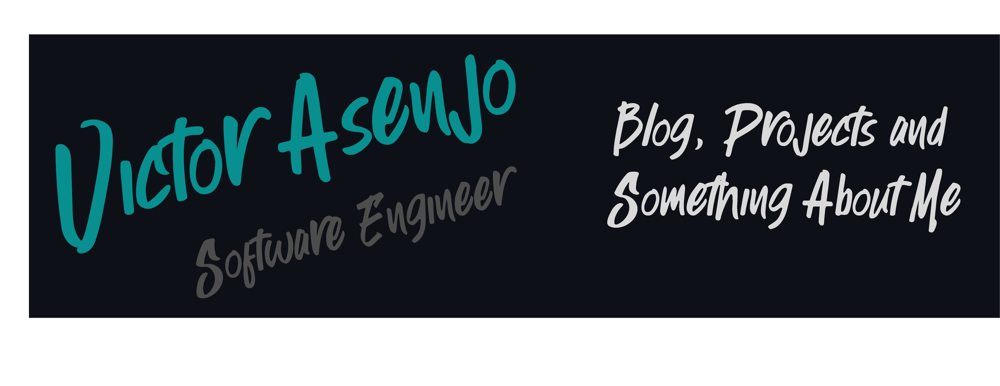
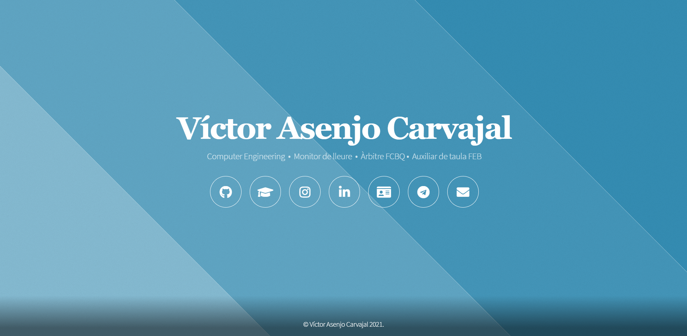

<h1> Hi there, I'm <a href=https://victor-asenjo.github.io>Víctor Asenjo</a> </h1>

 

Hi, I'm [Víctor Asenjo](https://victor-asenjo.github.io), a passionate self-taught full stack web developer and a software engineer student from Catalonia, Spain. My passion for software lies with dreaming up ideas and making them come true with elegant interfaces. I take great care in the experience, architecture, and code quality of the things I build.
  
- 🔭 I’m currently working on a Telegram Bot.
- 💬 Ask me about anything, I will try to answer as soon as possible;
- 📫 How to reach me: [email](mailto:victorasenj@gmail.com) (or [Telegram](https://telegram.me/victorasenjo) too)
- ⚡ Fun fact: I study at the Barcelona computer science faculty (FIB - UPC). Also known as the college that makes the best croquettes and cheese sandwich.

<h2>🤝🏻Connect with Me</h2>

  

<h2> Languages and tools:</h2> 

<code></code>
<code></code>
<code></code>
<code></code>
<code></code>
<code></code>
<code></code>
<code></code>

<h2>📈 Contribution Graph</h2>

<h2> GitHub Analytics</h2>

  
  

<h2> My repositories</h2>

  <!-- -->
  
  
  
  
  
  
  

<!--
Here are some ideas to get you started:

- 🔭 I’m currently working on ...
- 🌱 I’m currently learning ...
- 👯 I’m looking to collaborate on ...
- 🤔 I’m looking for help with ...
- 💬 Ask me about ...
- 📫 How to reach me: ...
- 😄 Pronouns: ...
- ⚡ Fun fact: ...
<code></code>
<code></code>
<code></code>
<code></code>

-->
